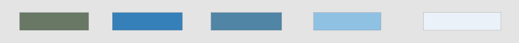
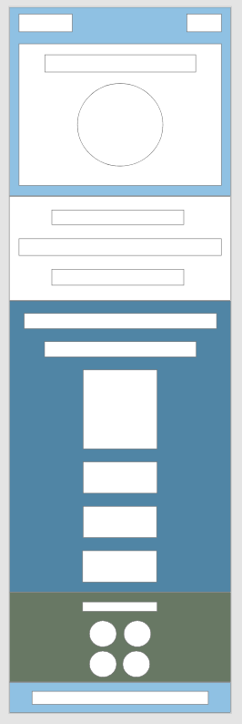
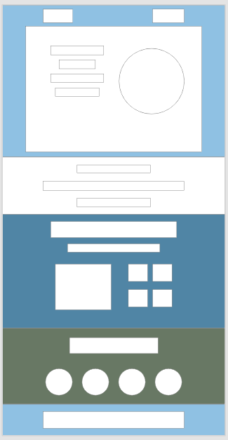
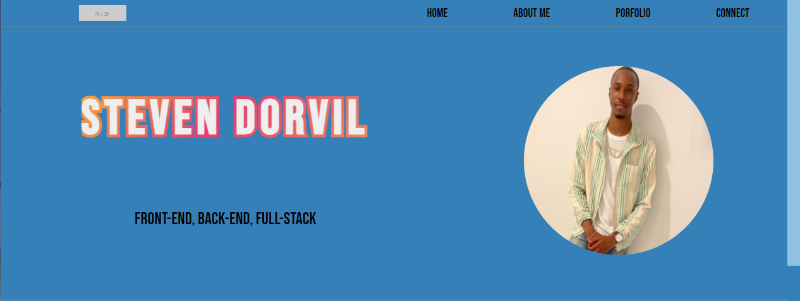
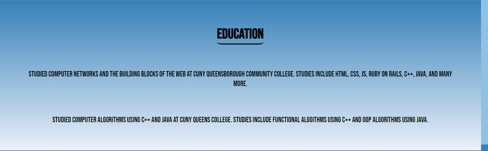
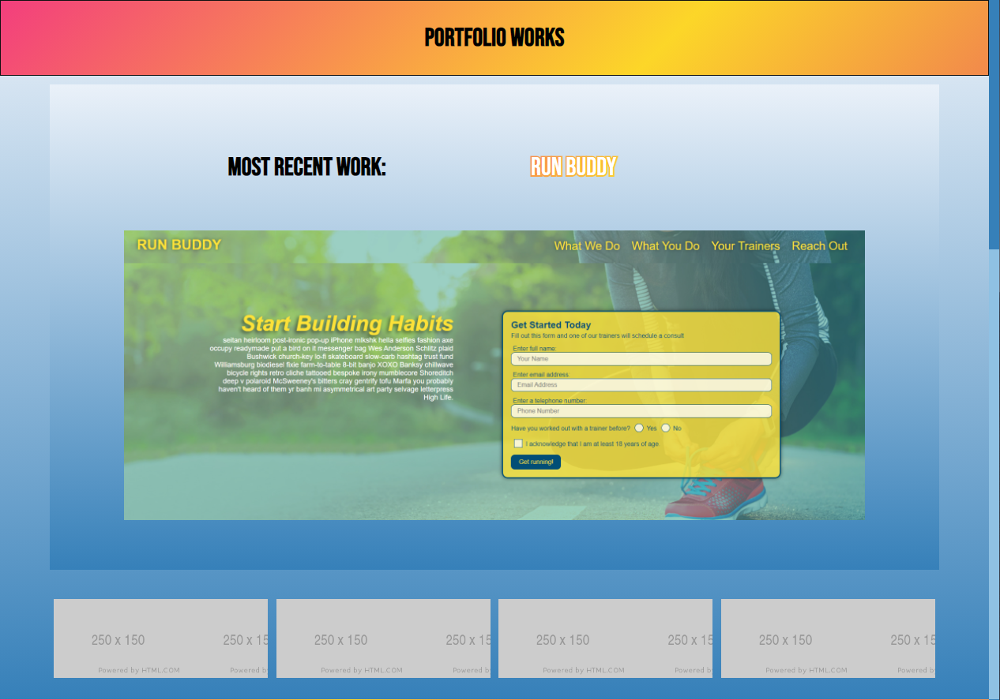
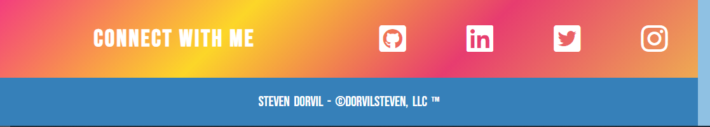
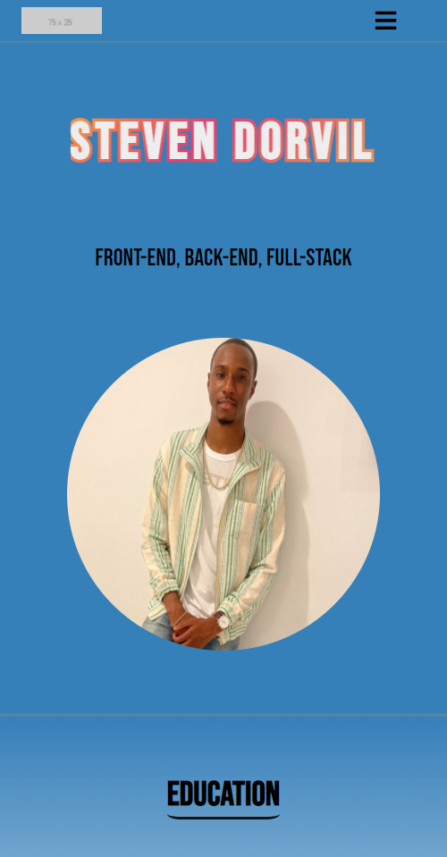
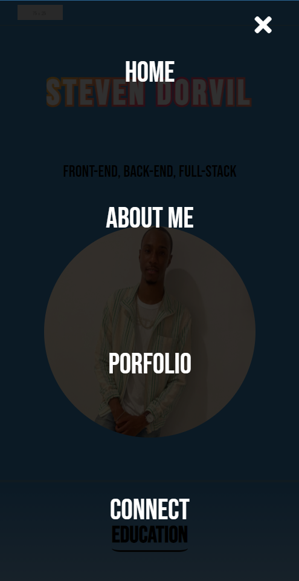

# dorvilsteven.github.io

## Welcome to the official portfolio site of Steven Dorvil

## Design

The design of my site was meant to be super basic, it first started with the colors
which i choose from an online source that generates beautiful color palettes.

After the color palette, i allowed the design to just come to me and adobe xd
became the tool i would use to create my design.

I started with a mbile first approach. Naturally came the design for larger devices next.

The design was a HUGE help in order to get the actual site setup. It was very easy for me to see how i needed to have my containers setup
in order to get my design right, and also helped me make some modifications much easier by isolating everything into parts that way if
i wanted to change only one part it wouldn't affect the others.

## Code

My site is broken up into 5 sections,

### the header

The header is made up of the navigation bar and the main header that showcases my name and photo

### the main bio

The bio section is a short description of all the technologies and programming languages that i've studied

### the main portfolio

The main portfolio section will house all of my works and future works

### the main connect section

### the footer

The main connect section will house all of the links to any main social sites where you can find more of me and my work
The footer is just a simple footer with my name

## Extras

I used a little bit of javascript in order to make a mobile view and have the menu become responsive and create a mobile view
I also used advanced CSS, to edit the scroll bar, and to create gradients and other effects like animations.

Here is a link to the site, please let me know about any bugs

[dorvilsteven.github.io](https://dorvilsteven.github.io/)
